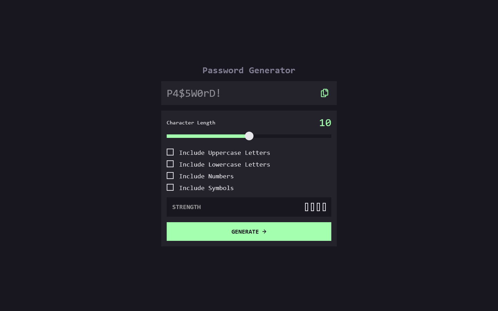
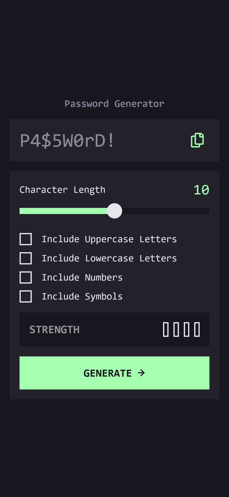

# Frontend Mentor - Password generator app solution

This is a solution to the [Password generator app challenge on Frontend Mentor](https://www.frontendmentor.io/challenges/password-generator-app-Mr8CLycqjh). Frontend Mentor challenges help you improve your coding skills by building realistic projects. 

## Table of contents

- [Overview](#overview)
  - [The challenge](#the-challenge)
  - [Screenshot](#screenshot)
  - [Links](#links)
- [My process](#my-process)
  - [Built with](#built-with)
  - [Useful resources](#useful-resources)
- [Author](#author)

## Overview

### The challenge

Users should be able to:

- Generate a password based on the selected inclusion options
- Copy the generated password to the computer's clipboard
- See a strength rating for their generated password
- View the optimal layout for the interface depending on their device's screen size
- See hover and focus states for all interactive elements on the page

### Screenshot

### Links

- Solution URL: [https://github.com/BarrosLucasJavier/password-generator-app](https://github.com/BarrosLucasJavier/password-generator-app)
- Live Site URL: [https://barroslucasjavier.github.io/password-generator-app/](https://barroslucasjavier.github.io/password-generator-app/)

## My process

### Built with

- Semantic HTML5 markup
- CSS custom properties
- Flexbox
- Mobile-first workflow

### Useful resources

- [Style Input Range](https://stackoverflow.com/questions/68085320/how-to-style-correctly-input-type-range) - I learned about how to modify specific styles of the input range.
- [Copy text to the clipboard](https://stackoverflow.com/questions/400212/how-do-i-copy-to-the-clipboard-in-javascript) - I learned different ways to copy to the clipboard.
- [Randomize (shuffle) a JavaScript Array](https://www.w3docs.com/snippets/javascript/how-to-randomize-shuffle-a-javascript-array.html) - I learned different ways to mix an array
- [Password Symbols Guide](https://phoenixite.com/password-symbols-guide-what-can-you-use/#:~:text=Along%20with%20uppercase%20letters%2C%20lowercase%20letters%2C%20and%20numbers%2C,it%20more%20difficult%20for%20malicious%20users%20to%20crack.) - Article on the use of symbols in the most common passwords.

## Author

- GitHub - [BarrosLucasJavier](https://github.com/BarrosLucasJavier)
- Frontend Mentor - [@BarrosLucasJavier](https://www.frontendmentor.io/profile/BarrosLucasJavier)

